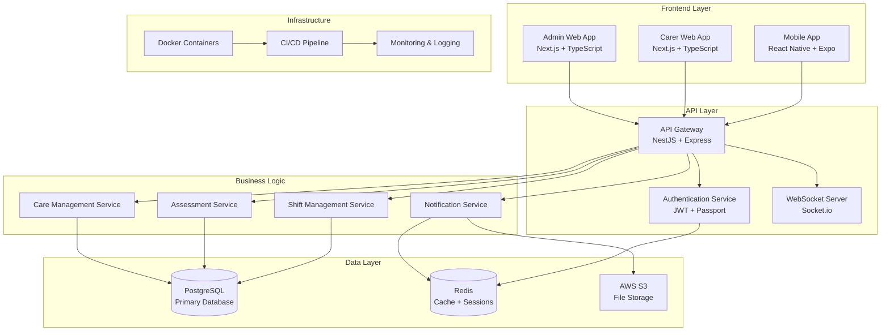
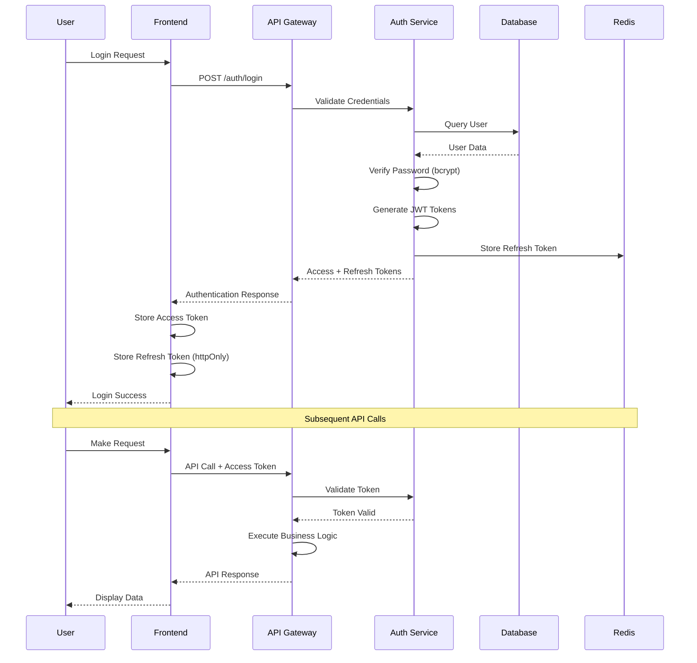

# Phase 0: Technical Foundation

## Overview
**Duration**: 2-3 weeks  
**Team Size**: 2-3 developers  
**Objective**: Establish robust technical foundation, architecture documentation, and development environment

## Objectives & Goals

### Primary Objectives
1. **Architecture Design**: Create comprehensive system architecture documentation
2. **Security Framework**: Design and implement security architecture
3. **Development Environment**: Set up consistent, reproducible development environment
4. **Database Design**: Create optimized database schema and migration strategy
5. **API Specification**: Define comprehensive API documentation using OpenAPI 3.0

### Success Criteria
- Complete technical architecture document approved by stakeholders
- Development environment reproducible in <10 minutes
- Database schema supports all planned features
- API specification covers all major endpoints
- Security architecture addresses all identified threats

## Technical Specifications

### Architecture Documentation Requirements

#### System Architecture Diagram


#### Technology Stack Documentation
```yaml
# Backend Stack
backend:
  framework: NestJS v10.x
  language: TypeScript v5.x
  runtime: Node.js v20.x (LTS)
  database: PostgreSQL v16.x
  orm: Prisma v5.x
  cache: Redis v7.x
  auth: JWT + Passport
  file_upload: Multer + AWS S3
  validation: class-validator + class-transformer + joi
  testing: Jest + Supertest
  documentation: Swagger/OpenAPI 3.0
  security: Helmet + express-rate-limit + bcrypt

# Frontend Stack
frontend:
  framework: Next.js v14.x
  language: TypeScript v5.x
  styling: Tailwind CSS v3.x
  components: shadcn/ui
  state: Zustand v4.x
  data_fetching: React Query v4.x
  forms: React Hook Form + Zod
  charts: Recharts v2.x
  testing: Jest + React Testing Library

# Mobile Stack
mobile:
  framework: React Native v0.72.x
  toolkit: Expo SDK v49.x
  language: TypeScript v5.x
  navigation: React Navigation v6.x
  state: Zustand v4.x
  data_fetching: React Query v4.x
  storage: Expo SecureStore
  notifications: Expo Notifications
  testing: Jest + React Native Testing Library

# DevOps Stack
devops:
  containerization: Docker v24.x
  orchestration: Docker Compose v3.8
  ci_cd: GitHub Actions
  monitoring: Sentry + Winston
  deployment: AWS ECS / Render
  database: AWS RDS PostgreSQL
  cache: AWS ElastiCache Redis
  storage: AWS S3
  cdn: AWS CloudFront
```

### Security Architecture Design

#### Authentication & Authorization Flow


#### Security Implementation Checklist
- [ ] **Password Security**: bcrypt hashing with salt rounds ≥12
- [ ] **Token Management**: JWT access tokens (15min) + refresh tokens (7days)
- [ ] **Two-Factor Authentication**: TOTP implementation with backup codes
- [ ] **Rate Limiting**: Express-rate-limit with Redis storage + sliding window
- [ ] **Input Validation**: class-validator with whitelist and transformation + Joi schemas
- [ ] **SQL Injection Prevention**: Prisma ORM with parameterized queries
- [ ] **XSS Prevention**: Helmet.js with CSP headers + DOMPurify for sanitization
- [ ] **CORS Configuration**: Restrictive CORS policy for production
- [ ] **Data Encryption**: AES-256 for sensitive data at rest + field-level encryption
- [ ] **Audit Logging**: Comprehensive activity logging with retention policy
- [ ] **Container Security**: Vulnerability scanning for Docker images
- [ ] **Environment Validation**: Strict environment variable validation schema
- [ ] **Security Headers**: Complete security headers implementation
- [ ] **API Security**: Request signing and API key management

### Database Schema Design

#### Core Tables Structure
```sql
-- Users and Authentication
CREATE TABLE users (
    id UUID PRIMARY KEY DEFAULT gen_random_uuid(),
    email VARCHAR(255) UNIQUE NOT NULL,
    password_hash VARCHAR(255) NOT NULL,
    role user_role NOT NULL DEFAULT 'carer',
    is_active BOOLEAN DEFAULT true,
    two_factor_enabled BOOLEAN DEFAULT false,
    two_factor_secret VARCHAR(255),
    email_verified BOOLEAN DEFAULT false,
    last_login TIMESTAMP,
    failed_login_attempts INTEGER DEFAULT 0,
    locked_until TIMESTAMP,
    created_at TIMESTAMP DEFAULT CURRENT_TIMESTAMP,
    updated_at TIMESTAMP DEFAULT CURRENT_TIMESTAMP
);

-- User Profiles
CREATE TABLE user_profiles (
    id UUID PRIMARY KEY DEFAULT gen_random_uuid(),
    user_id UUID NOT NULL REFERENCES users(id) ON DELETE CASCADE,
    first_name VARCHAR(100) NOT NULL,
    last_name VARCHAR(100) NOT NULL,
    phone VARCHAR(20),
    postcode VARCHAR(10),
    avatar_url VARCHAR(500),
    bio TEXT,
    created_at TIMESTAMP DEFAULT CURRENT_TIMESTAMP,
    updated_at TIMESTAMP DEFAULT CURRENT_TIMESTAMP
);

-- Care Packages
CREATE TABLE care_packages (
    id UUID PRIMARY KEY DEFAULT gen_random_uuid(),
    name VARCHAR(255) NOT NULL,
    postcode VARCHAR(10) NOT NULL,
    description TEXT,
    client_name VARCHAR(255), -- encrypted
    address_line1 VARCHAR(255), -- encrypted
    address_line2 VARCHAR(255), -- encrypted
    is_active BOOLEAN DEFAULT true,
    created_by UUID NOT NULL REFERENCES users(id),
    created_at TIMESTAMP DEFAULT CURRENT_TIMESTAMP,
    updated_at TIMESTAMP DEFAULT CURRENT_TIMESTAMP,
    deleted_at TIMESTAMP
);

-- Tasks
CREATE TABLE tasks (
    id UUID PRIMARY KEY DEFAULT gen_random_uuid(),
    name VARCHAR(255) NOT NULL,
    description TEXT,
    category VARCHAR(100),
    target_count INTEGER NOT NULL DEFAULT 1,
    is_competency_required BOOLEAN DEFAULT false,
    minimum_competency_level competency_level DEFAULT 'competent',
    is_active BOOLEAN DEFAULT true,
    created_by UUID NOT NULL REFERENCES users(id),
    created_at TIMESTAMP DEFAULT CURRENT_TIMESTAMP,
    updated_at TIMESTAMP DEFAULT CURRENT_TIMESTAMP,
    deleted_at TIMESTAMP
);

-- Carer Assignments to Care Packages
CREATE TABLE carer_assignments (
    id UUID PRIMARY KEY DEFAULT gen_random_uuid(),
    carer_id UUID NOT NULL REFERENCES users(id),
    care_package_id UUID NOT NULL REFERENCES care_packages(id),
    assigned_at TIMESTAMP DEFAULT CURRENT_TIMESTAMP,
    assigned_by UUID NOT NULL REFERENCES users(id),
    is_active BOOLEAN DEFAULT true,
    UNIQUE(carer_id, care_package_id)
);

-- Task Progress Tracking
CREATE TABLE task_progress (
    id UUID PRIMARY KEY DEFAULT gen_random_uuid(),
    carer_id UUID NOT NULL REFERENCES users(id),
    task_id UUID NOT NULL REFERENCES tasks(id),
    care_package_id UUID NOT NULL REFERENCES care_packages(id),
    current_count INTEGER DEFAULT 0,
    target_count INTEGER NOT NULL,
    is_completed BOOLEAN DEFAULT false,
    completed_at TIMESTAMP,
    last_updated TIMESTAMP DEFAULT CURRENT_TIMESTAMP,
    UNIQUE(carer_id, task_id, care_package_id)
);

-- Competency Tracking
CREATE TABLE carer_competencies (
    id UUID PRIMARY KEY DEFAULT gen_random_uuid(),
    carer_id UUID NOT NULL REFERENCES users(id),
    task_id UUID NOT NULL REFERENCES tasks(id),
    level competency_level NOT NULL DEFAULT 'not_assessed',
    assessed_by UUID REFERENCES users(id),
    assessed_at TIMESTAMP,
    notes TEXT,
    is_confirmed BOOLEAN DEFAULT false,
    confirmed_at TIMESTAMP,
    created_at TIMESTAMP DEFAULT CURRENT_TIMESTAMP,
    updated_at TIMESTAMP DEFAULT CURRENT_TIMESTAMP,
    UNIQUE(carer_id, task_id)
);

-- Audit Logs
CREATE TABLE audit_logs (
    id UUID PRIMARY KEY DEFAULT gen_random_uuid(),
    user_id UUID REFERENCES users(id),
    entity_type VARCHAR(100) NOT NULL,
    entity_id UUID NOT NULL,
    action VARCHAR(50) NOT NULL,
    old_values JSONB,
    new_values JSONB,
    ip_address INET,
    user_agent TEXT,
    created_at TIMESTAMP DEFAULT CURRENT_TIMESTAMP
);

-- Refresh Tokens
CREATE TABLE refresh_tokens (
    id UUID PRIMARY KEY DEFAULT gen_random_uuid(),
    user_id UUID NOT NULL REFERENCES users(id),
    token_hash VARCHAR(255) NOT NULL,
    expires_at TIMESTAMP NOT NULL,
    is_revoked BOOLEAN DEFAULT false,
    created_at TIMESTAMP DEFAULT CURRENT_TIMESTAMP,
    UNIQUE(token_hash)
);

-- Custom Types
CREATE TYPE user_role AS ENUM ('admin', 'carer', 'assessor', 'viewer');
CREATE TYPE competency_level AS ENUM ('not_assessed', 'competent', 'proficient', 'expert');
```

#### Database Optimization Strategy
```sql
-- Performance Indexes
CREATE INDEX idx_users_email ON users(email);
CREATE INDEX idx_users_role ON users(role);
CREATE INDEX idx_users_active ON users(is_active);
CREATE INDEX idx_care_packages_postcode ON care_packages(postcode);
CREATE INDEX idx_care_packages_active ON care_packages(is_active);
CREATE INDEX idx_tasks_category ON tasks(category);
CREATE INDEX idx_tasks_active ON tasks(is_active);
CREATE INDEX idx_carer_assignments_carer ON carer_assignments(carer_id);
CREATE INDEX idx_carer_assignments_package ON carer_assignments(care_package_id);
CREATE INDEX idx_task_progress_carer_task ON task_progress(carer_id, task_id);
CREATE INDEX idx_competencies_carer_task ON carer_competencies(carer_id, task_id);
CREATE INDEX idx_audit_logs_entity ON audit_logs(entity_type, entity_id);
CREATE INDEX idx_audit_logs_user ON audit_logs(user_id);
CREATE INDEX idx_audit_logs_created ON audit_logs(created_at);
CREATE INDEX idx_refresh_tokens_user ON refresh_tokens(user_id);
CREATE INDEX idx_refresh_tokens_hash ON refresh_tokens(token_hash);

-- Partial Indexes for Active Records
CREATE INDEX idx_active_care_packages ON care_packages(id) WHERE is_active = true;
CREATE INDEX idx_active_tasks ON tasks(id) WHERE is_active = true;
CREATE INDEX idx_active_assignments ON carer_assignments(carer_id, care_package_id) WHERE is_active = true;
```

### API Specification Design

#### OpenAPI 3.0 Structure
```yaml
openapi: 3.0.3
info:
  title: Care Management System API
  description: Comprehensive API for care package management, carer coordination, and competency tracking
  version: 1.0.0
  contact:
    name: Development Team
    email: dev@caremanagement.com
  license:
    name: MIT
    url: https://opensource.org/licenses/MIT

servers:
  - url: https://api.caremanagement.com/v1
    description: Production server
  - url: https://staging-api.caremanagement.com/v1
    description: Staging server
  - url: http://localhost:3000/v1
    description: Development server

security:
  - BearerAuth: []

paths:
  # Authentication Endpoints
  /auth/login:
    post:
      tags: [Authentication]
      summary: User login
      description: Authenticate user and return access/refresh tokens
      requestBody:
        required: true
        content:
          application/json:
            schema:
              type: object
              required: [email, password]
              properties:
                email:
                  type: string
                  format: email
                  example: admin@example.com
                password:
                  type: string
                  minLength: 8
                  example: SecurePass123!
                totpCode:
                  type: string
                  pattern: '^[0-9]{6}$'
                  example: '123456'
      responses:
        '200':
          description: Login successful
          content:
            application/json:
              schema:
                type: object
                properties:
                  user:
                    $ref: '#/components/schemas/User'
                  accessToken:
                    type: string
                  refreshToken:
                    type: string
                  expiresIn:
                    type: integer
                    example: 900
        '401':
          description: Invalid credentials
        '423':
          description: Account locked due to too many failed attempts

  /auth/refresh:
    post:
      tags: [Authentication]
      summary: Refresh access token
      requestBody:
        required: true
        content:
          application/json:
            schema:
              type: object
              required: [refreshToken]
              properties:
                refreshToken:
                  type: string
      responses:
        '200':
          description: Token refreshed successfully
        '401':
          description: Invalid refresh token

  # User Management Endpoints
  /users:
    get:
      tags: [User Management]
      summary: Get all users
      parameters:
        - name: page
          in: query
          schema:
            type: integer
            default: 1
        - name: limit
          in: query
          schema:
            type: integer
            default: 20
            maximum: 100
        - name: role
          in: query
          schema:
            $ref: '#/components/schemas/UserRole'
        - name: search
          in: query
          schema:
            type: string
      responses:
        '200':
          description: Users retrieved successfully
          content:
            application/json:
              schema:
                type: object
                properties:
                  users:
                    type: array
                    items:
                      $ref: '#/components/schemas/User'
                  pagination:
                    $ref: '#/components/schemas/Pagination'

components:
  schemas:
    User:
      type: object
      properties:
        id:
          type: string
          format: uuid
        email:
          type: string
          format: email
        role:
          $ref: '#/components/schemas/UserRole'
        isActive:
          type: boolean
        profile:
          $ref: '#/components/schemas/UserProfile'
        createdAt:
          type: string
          format: date-time
        updatedAt:
          type: string
          format: date-time
    
    UserRole:
      type: string
      enum: [admin, carer, assessor, viewer]
    
    UserProfile:
      type: object
      properties:
        firstName:
          type: string
        lastName:
          type: string
        phone:
          type: string
        postcode:
          type: string
        avatarUrl:
          type: string
    
    Pagination:
      type: object
      properties:
        page:
          type: integer
        limit:
          type: integer
        total:
          type: integer
        totalPages:
          type: integer
        hasNext:
          type: boolean
        hasPrev:
          type: boolean

  securitySchemes:
    BearerAuth:
      type: http
      scheme: bearer
      bearerFormat: JWT
```

## Detailed Task Breakdown

### Week 1: Architecture & Documentation

#### Day 1-2: System Architecture
- [ ] **System Architecture Diagram**: Create comprehensive system architecture using Mermaid
- [ ] **Technology Stack Documentation**: Document all technologies with versions and justifications
- [ ] **Component Interaction Mapping**: Define how all components interact
- [ ] **Data Flow Diagrams**: Create data flow diagrams for critical processes
- [ ] **Scalability Planning**: Document scaling strategies and bottlenecks

#### Day 3-4: Security Architecture
- [ ] **Threat Model**: Create STRIDE threat model for the system
- [ ] **Security Requirements**: Define security requirements for each component
- [ ] **Authentication Flow**: Design JWT authentication and refresh token flow
- [ ] **Authorization Matrix**: Create RBAC permission matrix
- [ ] **Security Controls**: Document all security controls and their implementation

#### Day 5: Database Design & Validation
- [ ] **Entity Relationship Diagram**: Create comprehensive ERD
- [ ] **Database Schema**: Write complete SQL schema with constraints
- [ ] **Migration Strategy**: Plan database migration and versioning strategy
- [ ] **Performance Optimization**: Design indexing strategy
- [ ] **Backup Strategy**: Plan backup and disaster recovery procedures
- [ ] **Environment Validation**: Implement environment variable validation schema
- [ ] **Connection Pooling**: Configure database connection pooling
- [ ] **Data Retention**: Define data retention and archiving policies

### Week 2: API Design & Development Environment

#### Day 1-2: API Specification
- [ ] **OpenAPI Specification**: Create complete OpenAPI 3.0 specification
- [ ] **Endpoint Documentation**: Document all major endpoints with examples
- [ ] **Request/Response Schemas**: Define all data schemas
- [ ] **Error Handling**: Standardize error responses and codes
- [ ] **Versioning Strategy**: Plan API versioning approach

#### Day 3-4: Development Environment
- [ ] **Docker Configuration**: Create Docker and Docker Compose files
- [ ] **Environment Variables**: Define all required environment variables
- [ ] **Local Development Setup**: Create setup scripts for local development
- [ ] **IDE Configuration**: Configure VSCode/IDE settings and extensions
- [ ] **Git Configuration**: Set up Git hooks and commit conventions

#### Day 5: Project Structure
- [ ] **Monorepo Setup**: Create monorepo structure with apps and packages
- [ ] **NestJS Project**: Initialize NestJS project with proper structure
- [ ] **Frontend Projects**: Initialize Next.js projects for admin and carer apps
- [ ] **Mobile Project**: Initialize React Native project with Expo
- [ ] **Shared Packages**: Create shared packages for types and utilities

### Week 3: Implementation Foundation

#### Day 1-2: Database Setup
- [ ] **PostgreSQL Configuration**: Set up PostgreSQL with optimal settings
- [ ] **Prisma Setup**: Initialize Prisma with database connection
- [ ] **Migration System**: Create initial migration files
- [ ] **Seed Data**: Create seed data for development
- [ ] **Database Testing**: Set up test database configuration

#### Day 3-4: Backend Foundation
- [ ] **NestJS Configuration**: Configure NestJS with all required modules
- [ ] **Authentication Module**: Implement JWT authentication system
- [ ] **Authorization Guards**: Create role-based authorization guards
- [ ] **Validation Pipes**: Set up input validation with class-validator
- [ ] **Error Handling**: Implement global error handling and logging

#### Day 5: Testing & Documentation
- [ ] **Unit Testing Setup**: Configure Jest for unit testing
- [ ] **Integration Testing**: Set up Supertest for API testing
- [ ] **Test Database**: Configure test database and cleanup
- [ ] **API Documentation**: Generate Swagger documentation
- [ ] **Development Documentation**: Create developer onboarding guide

## Security Considerations

### Authentication Security
- **Password Policy**: Minimum 8 characters, complexity requirements
- **Account Lockout**: 5 failed attempts, 30-minute lockout
- **Session Management**: Secure session handling with Redis
- **Token Security**: Short-lived access tokens, secure refresh tokens
- **Two-Factor Authentication**: TOTP with backup codes

### Data Protection
- **Encryption at Rest**: AES-256 encryption for sensitive data
- **Encryption in Transit**: TLS 1.3 for all communications
- **PII Protection**: Encrypt personally identifiable information
- **Data Anonymization**: Anonymize data in logs and analytics
- **Secure Storage**: Use secure storage for sensitive files

### API Security
- **Rate Limiting**: Implement rate limiting to prevent abuse
- **Input Validation**: Validate all inputs with strict schemas
- **SQL Injection Protection**: Use parameterized queries
- **XSS Prevention**: Sanitize all user inputs
- **CORS Configuration**: Restrictive CORS policy

### Infrastructure Security
- **Network Security**: Use VPC and security groups
- **Container Security**: Scan containers for vulnerabilities
- **Secrets Management**: Use secure secrets management
- **Monitoring**: Implement security monitoring and alerting
- **Compliance**: Ensure GDPR and data protection compliance

## Testing Requirements

### Unit Testing
- **Coverage Target**: 80% code coverage minimum
- **Test Framework**: Jest with TypeScript support
- **Mocking Strategy**: Mock external dependencies
- **Test Data**: Use factories for test data generation
- **Continuous Testing**: Run tests on every commit

### Integration Testing
- **API Testing**: Test all API endpoints
- **Database Testing**: Test database interactions
- **Service Integration**: Test service-to-service communication
- **Authentication Testing**: Test authentication flows
- **Authorization Testing**: Test permission enforcement

### End-to-End Testing
- **Critical Path Testing**: Test main user journeys
- **Browser Testing**: Test across different browsers
- **Mobile Testing**: Test mobile application flows
- **Performance Testing**: Test response times and load
- **Security Testing**: Test security controls

## Deployment Steps

### Development Environment
1. **Local Setup**: Docker Compose for local development
2. **Database**: PostgreSQL with sample data
3. **Cache**: Redis for session management
4. **File Storage**: Local file system or MinIO
5. **Monitoring**: Basic logging and error tracking

### Staging Environment
1. **Cloud Setup**: AWS/Render staging environment
2. **Database**: Managed PostgreSQL instance
3. **Cache**: Managed Redis instance
4. **File Storage**: AWS S3 bucket
5. **Monitoring**: Comprehensive monitoring and alerting

### Production Environment
1. **High Availability**: Multi-AZ deployment
2. **Load Balancing**: Application load balancer
3. **Auto Scaling**: Auto-scaling groups
4. **Backup**: Automated backup and disaster recovery
5. **Monitoring**: Full observability stack

## Milestone Criteria

### M0.1: Architecture Documentation Complete
- [ ] System architecture diagram approved
- [ ] Technology stack documented and justified
- [ ] Security architecture designed and reviewed
- [ ] Database schema designed and optimized
- [ ] API specification complete and validated

### M0.2: Development Environment Ready
- [ ] Docker development environment working
- [ ] Database setup and migration working
- [ ] All developers can set up environment in <10 minutes
- [ ] Basic NestJS application running
- [ ] Authentication system functional

### M0.3: Foundation Implementation Complete
- [ ] Database migrations working
- [ ] Basic CRUD operations implemented
- [ ] Authentication and authorization working
- [ ] API documentation generated
- [ ] Testing framework operational

## Dependencies & Risks

### Dependencies
- **Team Availability**: Requires 2-3 developers for 3 weeks
- **Technology Decisions**: Final approval on technology stack
- **Infrastructure Access**: Access to cloud accounts and services
- **Security Review**: Security team review of architecture
- **Stakeholder Approval**: Approval of system architecture

### Risks & Mitigation

#### Technical Risks
- **Database Performance**: Risk of slow queries with large datasets
  - **Mitigation**: Proper indexing, query optimization, connection pooling
- **Security Vulnerabilities**: Risk of security flaws in design
  - **Mitigation**: Security review, penetration testing, security training
- **Technology Compatibility**: Risk of incompatible technology versions
  - **Mitigation**: Lock dependency versions, regular updates

#### Schedule Risks
- **Complexity Underestimation**: Risk of underestimating architecture complexity
  - **Mitigation**: Add 20% buffer time, regular progress reviews
- **Team Availability**: Risk of team members being unavailable
  - **Mitigation**: Cross-training, documentation, backup team members
- **External Dependencies**: Risk of delays in external services
  - **Mitigation**: Identify alternatives, early integration testing

## Success Metrics

### Technical Metrics
- **Setup Time**: <10 minutes for new developer onboarding
- **Code Coverage**: >80% unit test coverage
- **Security Score**: Pass all security scans
- **Performance**: <200ms API response times
- **Documentation**: 100% API endpoints documented

### Business Metrics
- **Stakeholder Approval**: 100% approval of architecture
- **Team Confidence**: High team confidence in technical decisions
- **Risk Mitigation**: All identified risks have mitigation plans
- **Timeline Adherence**: Phase completed on schedule
- **Quality**: Zero critical defects in foundation

## Next Phase Preparation

### Phase 1 Prerequisites
- [ ] Complete database schema implemented
- [ ] Authentication system fully operational
- [ ] Development environment documented
- [ ] Testing framework established
- [ ] API specification validated

### Handoff Documentation
- [ ] Architecture decision records
- [ ] Development setup guide
- [ ] Testing procedures
- [ ] Security guidelines
- [ ] Deployment procedures

### Knowledge Transfer
- [ ] Team training on architecture
- [ ] Code review guidelines
- [ ] Security best practices
- [ ] Testing standards
- [ ] Documentation standards